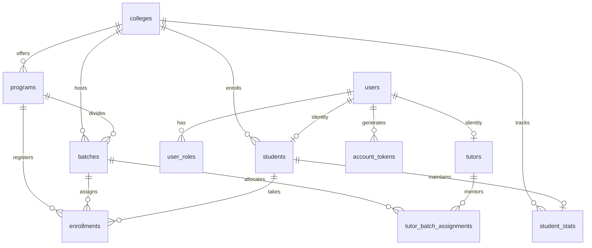

# Database Architecture & Drizzle Schema

This document details the PostgreSQL database schema, connection architecture, migration management, and relational models in `@rms/db`.

---

## 1. Connection Architecture

- **Engine**: PostgreSQL hosted on **Neon Serverless**.
- **Driver**: `@neondatabase/serverless` using the HTTP query protocol (`drizzle-orm/neon-http`).
- **Connection Configuration**:
  - Connection string loaded via `process.env.POSTGRES_URL`.
  - Fallback placeholder connection string is provided in development/build to prevent static page compilation from failing when `POSTGRES_URL` is omitted.
  - Queries are stateless over HTTP, providing instantaneous cold-starts without connection pool exhaustion in serverless environments.

---

## 2. Core Relational Schema

### Table Definitions

1. **`colleges`**: Institutional entities (ID, Name, Unique Code, City, State, Active flag).
2. **`users`**: Platform identity accounts (Email, Name, Bcrypt Password Hash, Status, Email Verified At, Last Login).
3. **`user_roles`**: RBAC permissions mapping users to roles (`super_admin`, `admin`, `tutor`, `student`).
4. **`account_tokens`**: Single-use, expiring SHA-256 tokens for password reset and account activation.
5. **`tutors`**: Instructor and evaluator profiles (Headline, Bio, LinkedIn, GitHub).
6. **`students`**: Student records linked to college, roll number, branch, and academic year.
7. **`student_stats`**: Gamified progression ledger (Total XP, Current Level, Daily Streak, Longest Streak, DSA Solved Count).
8. **`programs`**: Training programs and courses (Name, Unique Code, Description, Status, Capacity, Dates).
9. **`batches`**: Cohort batch allocations under a specific program and college.
10. **`tutor_batch_assignments`**: Many-to-many relationship linking tutors to cohort batches.
11. **`enrollments`**: Registration records linking a student to a program and optional batch with status tracking.

---

## 3. Migration Safety & DDL Rules

- Migrations are managed by Drizzle Kit and located in `packages/db/drizzle/`.
- **PostgreSQL Enum Transaction Hazard**:
  - In PostgreSQL, new enum values (`ALTER TYPE ... ADD VALUE 'active'`) cannot be used within the same transaction where they were created.
  - Any migration that modifies an enum type and creates an index or table referencing that new enum value must separate the enum modification and the index creation into distinct non-conflicting steps or distinct migrations.
- Always run `pnpm --filter @rms/db db:migrate` to apply migrations.
